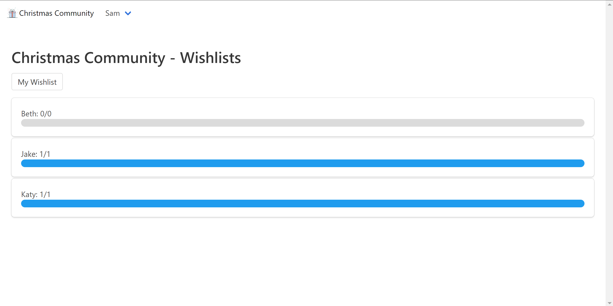
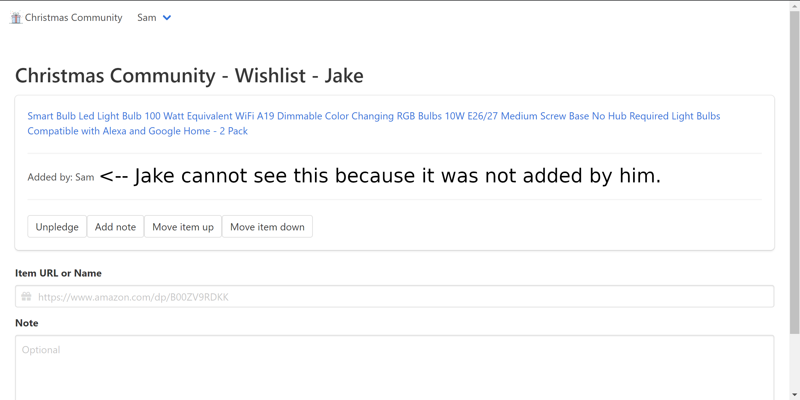
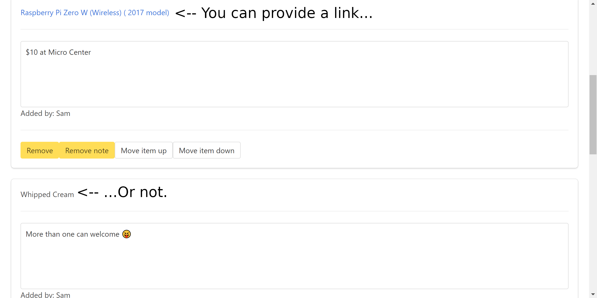
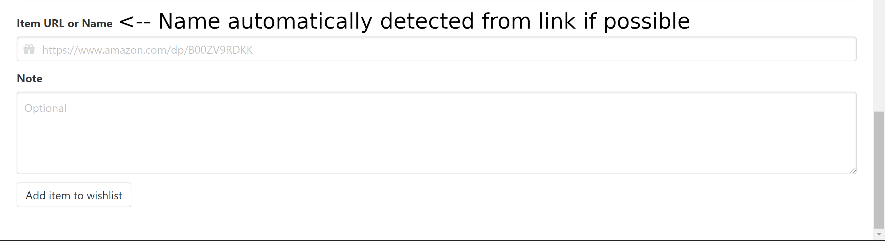

# Christmas Community


Web app for your family's Christmas shopping

## Purpose
To create a simple place for your entire family to use to find gifts that people want, and to avoid double-gifting.

## Screenshots





## Amazon Smile
By default, Christmas Community converts www.amazon.com links to smile.amazon.com. If you do not want this, set the environment variable SMILE to false (if you are using Docker Compose, make sure to put "false" in quotes).

## Root Path
If you want put Christmas Community on a subdirectory, such as `/christmas-community`, set `ROOT_PATH` to that path.

## Docker
```
docker run --detach --name christmas-community -p 80:80 --restart always wingysam/christmas-community
```

## Docker Compose
```yml
---
version: "3"
services:
  christmas-community:
    image: wingysam/christmas-community
    volumes:
      - ./data:/data
    ports:
      # If you want to go to localhost:8080 to access Christmas Community,
      # use - 8080:80 instead of
      - 80:80
    environment:
      # Amazon Smile, set to 'false' to disable www.amazon.com links
      # turning into smile.amazon.com
      SMILE: 'true'
      # Table mode, set to 'false' to revert to box mode
      TABLE: 'true'
      # Single list mode
      # (for weddings, birthdays, etc. only the admin account's list is accessible)
      # Set to 'true' to enable
      SINGLE_LIST: 'false'
    restart: always
```

## Install
```sh
git clone https://github.com/wingysam/Christmas-Community
cd Christmas-Community
yarn
```

## Configuration
Add environment variables with a .env. Example:
```sh
## Core Settings
# Where to store databases, can be a CouchDB compatible server or directory.
DB_PREFIX=dbs/
# Where to send someone if they need to log in
DEFAULT_FAILURE_REDIRECT=/login
# Port to listen on
PORT=80
# Expose the internal PouchDB with CouchDB API and Fauxton browser. Mostly used for debugging. Leave empty to disable.
DB_EXPOSE_PORT=
# Proxy to send item data requests to. Leave empty to disable.
PROXY_SERVER=
# Secret string to store session cookies with. Automatically generated if not provided.
SECRET=
# How long a user is logged in (milliseconds). Defaults to one week.
SESSION_MAX_AGE=604800000
# The name of the site in the <title> and navigation bar
SITE_TITLE=Christmas Community
# Used when shared to home screen
SHORT_TITLE=Christmas
# The root path for forms, CSS, and a small amount of JS. Useful when proxying.
ROOT_PATH=/
# Where to trust the X-Forwarded-For header from. Defaults to "loopback". Useful for proxying to docker.
TRUST_PROXY=loopback
# Any theme from https://jenil.github.io/bulmaswatch
BULMASWATCH=default
# Set to false to disable update notices
UPDATE_CHECK=true
# Set to false to disable the profile pictures feature
PFP=true
# Language of the interface, options listed in `languages` directory
LANGUAGE=en-US

## Wishlist Settings
# Set to true to not allow users to have their own lists. You may want this for a birthday or wedding.
SINGLE_LIST=false
# Set to false to allow viewing wishlists without logging in
LISTS_PUBLIC=false
# Defaults to true. Set to false for legacy cards view.
TABLE=true
# Convert Amazon links to Amazon Smile links. A percentage of the profit goes to a charity of buyer's choice. Defaults to true.
SMILE=true
# Allow Markdown in item notes. Does not work with TABLE=false. Defaults to false.
MARKDOWN=false

## Custom HTML Snippets
# These are inserted into specific locations in the relevant page
# HTML is not escaped. Don't put untrusted data here.
# CUSTOM_HTML_LOGIN=<p style="margin-top: 1em;">Some custom text for the Login page</p>
# CUSTOM_HTML_WISHLISTS=

# Custom CSS stylesheet
# If you wish to include a custom stylesheet you can add the filename in the variable here.
# Remember to add the stylesheet to the filesystem at `static/css/custom.css`. In docker, mount `/usr/src/app/src/static/css/custom.css`.
# CUSTOM_CSS=custom.css
```

## Default Profile Pictures
To replace the default snowman profile pictures, replace the files in `static/img/default-pfps`. In docker, mount `/usr/src/app/src/static/img/default-pfps`.

## Startup
```sh
npm start
```

## Setup
Visit `/` on the HTTP server to add an admin account.

# Adding Sites
Christmas Community gets data about products automatically with [Wingysam/get-product-data](https://github.com/Wingysam/get-product-data). Please submit pull requests for new sites or fixes for changes to existing sites!
# About Developer
Hi, I'm Wingy. I made this app. My website is [wingysam.xyz](https://wingysam.xyz). Please [hire me](https://wingysam.xyz/hire).

[](https://ko-fi.com/C1C2347HB)

# Contributors
As of writing, there are no code contributors to the main project. However, there are issue contributors and I appreciate these! Ideas on which features to add and bug reports are very helpful. Thank you!

## Language Contributors
* English: [dotromain](https://github.com/dotromain), [o-pteron](https://github.com/o-pteron)
* Czech: [drSchaps](https://github.com/drSchaps)
* German: [PeteS4](https://github.com/PeteS4)
* French: [zethis](https://github.com/zethis)
* Spanish: [CantisW](https://github.com/CantisW)